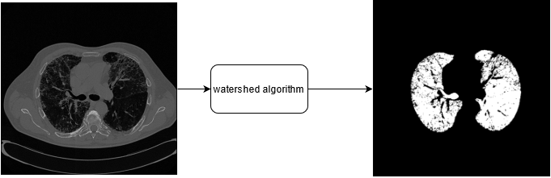
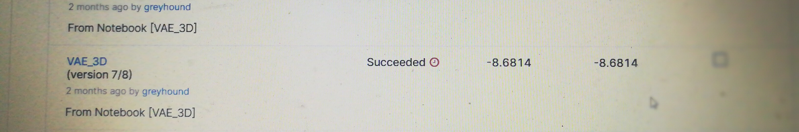

# OSIC_VAE
## Procedure followed
- Segmented the 3D images using watershed algorithm. 
- Used variational autoencoder for feature engineering
- Concatenated the extracted features with tabular features and trained a simple neural network.

## Segmenttion Results

## Final Results

## References
- H-DenseUNet: Hybrid Densely Connected UNet for Liver and Tumor Segmentation from CT Volumes
- https://www.kaggle.com/aadhavvignesh/lung-segmentation-by-marker-controlled-watershed
